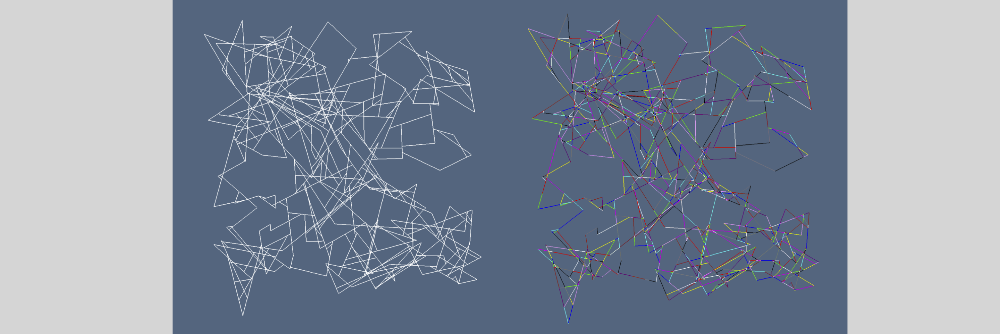

Every $2$-cell $\sigma$ in the input set $\mathcal{S}_2$ is *independently* intersected with the others of possible intersection, producing its own arrangement of $\E^2$ space as a chain 2-complex $C_\bullet(\sigma)$. 

The 2-cells of possible intersection with $\sigma$ are those whose containment boxes intersect the box of $\sigma$.

### Splitting of 2-cells in 2D

Each set $\mathcal{I}(\sigma)$ of $2$-cells of possible
intersection with $\sigma$, is efficiently computed by combinatorial intersection
of query results  on $d$ different (one for each coordinate)
interval-trees. 

Every
$\mathcal{I}(\sigma)$ set, for $\sigma\in\mathcal{S}_2$, is affinely mapped in $\E^3$, 
leading $\sigma$ to the $z=0$ subspace.  The arrangement
$\mathcal{A}(\sigma) = C_\bullet(\sigma)$  is firstly computed in $\E^2$, and then mapped back into $\E^3$. 

The actual intersection of 2-cells is computed between line segments in 2D, retaining only the non external part of the maximal 2-connected subgraph of results, so obtaining a regular 2-complex decomposition of 2-cell $\sigma$. See Figure in Example \ref{fig:2D}.

This computation is executed *independently* for each 2-cell $\sigma$ in the input 
cellular complexes. 
To strongly accelerate the computation, the splitting may be computed through Julia's \texttt{channels}, which are able to take advantage of 
both local and remote compute nodes, making use of this *embarrassingly parallel* 
data-driven approach.

(a) input to *cell splitting* Algorithm: *i.e.*, the 2-cell $\sigma$ (signed blue) and the line segments (solid lines), from intersection of $\mathcal{I}(\sigma)$ with the plane $z=0$ ; 
(b) all pairwise intersections of such 1-cells in 2D, producing a planar graph; 
(c) removal of the 1-subgraph external to $\partial\sigma$; 
(d) chain 2-complex (0-, 1-, and 2-cells) generated by $\sigma\cup\mathcal{I}(\sigma)$ via Topological Gift Wrapping algorithm in 2D.

### Time complexity
The  complexity of the 2-cell subdivision Algorithm \ref{alg:splitting} can be regarded in the average case as linear in the total number of 2-cells, times a $\log n$ factor, needed to compute those of probable intersection, when the splitting of a single cell may be considered done in constant time. I

n fact, normally, each cell is small with respect to the scene, and is intersected by a small number of other cells. Under this hypotheses both the mapping to/from $z=0$ and each 1-cell intersection are done in constant time and are in small number. 

Furthermore, the 2D cell complex creation produces two small sparse matrices $\delta_0(\sigma)$ and $\delta_1(\sigma)$ per 2-cell $\sigma$. The numbers of their rows and columns are those of vertices, edges and faces of the split $\sigma$, i.e. very small bounded numbers. The complexity of splitting Algorithm is hence $O(\ell k\, (n\log n))$, with $\ell$ average number of produced component cells (depending on both size e incidence number of each $\sigma$) and $0\leq k\leq 1$, a distribution factor inversely proportional to the number of used cores. 

The initial construction of interval trees has the same complexity of (double) sorting of intervals.

### Example

